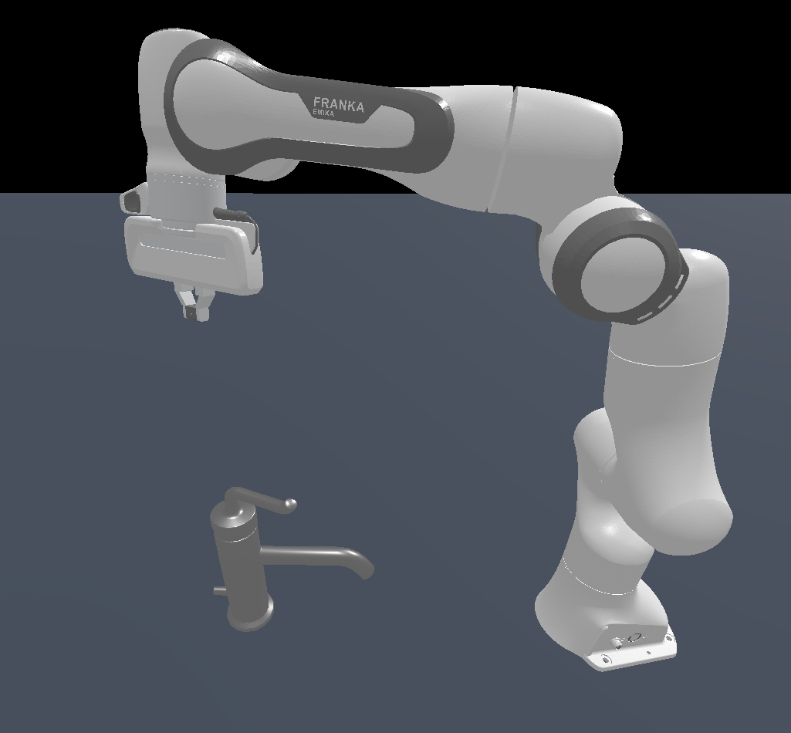
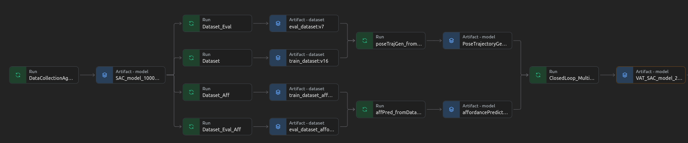

# captAIn
**C**losed-loop **A**ffordance **P**rediction and **T**rajectory Generation for **A**daptive **I**nteraction with **N**ovel Objects

This is repository contains all the code used for my Master's Thesis on "Visual Reinforcement Learning for Generalizable Object Manipulation".
It implements the proposed method called captAIn, as well as all baselines used in the thesis.



---
**Table of Contents**

- [Installation](#installation)
- [Inference](#inference)
- [Training](#training)
- [Structure](#structure)
- [Weights And Biases](#weights-and-biases)

---

## Installation


### Prerequisites
For this repository you will need a cuda-enabled GPU. The code was tested using the Nvidia RTX 2060, RTX 2080, and GTX Titan X.
Additionally you need to have vulkan drivers installed.
Also miniconda is used to manage the virtual environment with all it's packages.

### Guide

The following installation process assumes the above dependencies to be met.


create conda environment

```bash
conda create -n captAIn python=3.8
```

activate environment

```bash
conda activate captAIn
```

install pytorch related dependencies

```bash
conda install pytorch==1.11.0 torchvision==0.12.0 torchaudio==0.11.0 cudatoolkit=11.3 -c pytorch
```

pip-install ManiSkill2 and ManiSkill2-Learn packages.

```bash
pip install -e ./ManiSkill2
pip install -e ./ManiSkill2-Learn
```

download the faucet models
```bash
cd ManiSkill2/
```

```bash
python -m mani_skill2.utils.download_asset "TurnFaucet-v0"
```

navigate back to main directory
```bash
cd ..
```

create sim-link inside ManiSkill2-Learn

```bash
cd ManiSkill2-Learn/
```

```bash
ln -s ../ManiSkill2/data data
```

navigate back to main directory
```bash
cd ..
```

install package required for PointNet++ implementation
```bash
cd ManiSkill2-Learn/maniskill2_learn/networks/backbones/Pointnet2_PyTorch
```

```bash
pip install -r requirements.txt
```

```bash
pip install -e .
```

---

Test your installation. You should see a window with a scene depicting a robot and a faucet.

```bash
python -m ManiSkill2.mani_skill2.examples.demo_random_action
```

---

The repository makes use of  Weights and Biases (wandb). Even if you do not wish to use the wandb
functionality it is still required to install the wandb package. More information on how to use wandb for tracking experiments and storing
models is given in [Weights And Biases](#weights-and-biases)

```bash
pip install wandb
```

On the cluster it could be that additional packages and dependencies need to be installed. For instance:

```bash
pip install nvidia-ml-py==11.495.46
```
---

## Inference
To run an inference with the trained captAIn model run the following command from the main directory:
```bash
bash scripts/captain_inference.sh
```

To do inference with VAT-Mart run the following:
```bash
bash scripts/vat_mart_inference.sh
```

To visualize the trajectories the following command can be used. Prior to running the script you have to specify the location of the h5 file containing the trajectories.
The trajectories are automatically stored in a h5 file, if in the config file used during inference the eval_cfg.save_traj is set to True.
The script will also play the respective video of the rollout if it exits. Videos are automatically recorded during inference/rollout if the eval_cfg.save_video is set to True.

```bash
bash scripts/visualization/render_trajectory.sh
```
---

## Training
In order to train captAIn, several steps are required. If you wish to start a completely new training you have to
- Train a data collection agent (optional) 
- Collect a dataset, either with the data collection agent, or with the direct data collection method
- Train the Affordance Predictor
- Train the Pose Trajectory Generator
- Train the Interaction Policy
- Continual Learning

This repository also provides the checkpoint of the trained data collection agent, as well as checkpoints of the trained
Affordance Predictor and Pose Trajectory Generator. So you can decide yourself at which of the above steps you want to begin.

To better understand how the scripts and config files work, it is recommended to check out the Readme in the ManiSkill2-Learn directory.

### Faucet Models
The model IDs used for training and evaluation are define in 
- faucetID_HoldOutDataSet.txt
- faucetOOD_HoldOutDataSet.txt
- faucetTrainingDataSet.txt
under the ManiSkill2 directory

The model IDs contained in the txt files are passed to the TurnFaucet environment during construction.
The faucetID_HoldOutDataSet.txt and faucetOOD_HoldOutDataSet.txt are passed to the evaluation environment, while the models from
faucetTrainingDataSet.txt are used in the training environment.

All available faucet models are contained in ManiSkill2/data

### Train Data Collection Agent
The full training pipeline starting from the data collection agent looks as follows. Note that this pipeline assumes you
do not use Weights and Biases, but instead store all your models & datasets locally.

```bash
bash scripts/data_collection_agent.sh
```
---
### Collect All Datasets Using the Data Collection Agent
Note that you have to specify the location of the checkpoint of the data collection agent inside the scripts. This checkpoint
will be used to collect the datasets.


Training dataset for the Pose Trajectory Generator
```bash
bash scripts/data_collection_train.sh
```

Eval dataset for the Pose Trajectory Generator
```bash
bash scripts/data_collection_eval.sh
```

Training dataset for the Affordance Predictor
```bash
bash scripts/data_collection_train_aff.sh
```

Eval dataset for the Affordance Predictor
```bash
bash scripts/data_collection_eval_aff.sh
```
---
### Direct Data Collection Method
The direct data collection method allows to collect a dataset without training an agent. However,
you still have to specify a valid model checkpoint. The model will interact with the environment, however, the actions
will not be used inside the environment. So it does not matter what agent you specify, it could be an arbitrary model checkpoint
that is then loaded in the run_rl.py script.

```bash
bash scripts/data_collection_eval_aff.sh
```
---
### Training the Affordance Predictor
Before running this command you have to specify the location of the datasets, used for training the Affordance Predictor under
ManiSkill2-Learn/configs/vat-mart/vat-mart_bc.py , namely in the eval_cfg and replay_cfg.

```bash
bash scripts/affordance_predictor.sh
```
---
### Training the Pose Trajectory Generator
Before running this command you have to specify the location of the datasets, used for training the Pose Trajectory Generator under
ManiSkill2-Learn/configs/vat-mart/vat-mart_bc.py , namely in the eval_cfg and replay_cfg.

```bash
bash scripts/pose_trajectory_generator.sh
```

Also, note that captAIn uses the Pose Trajectory Generator, while VAT-Mart uses the Trajectory Generator. The sole difference
between these two models, is that the Pose Trajectory Generator is trained to reconstruct the sequence of TCP poses presented 
in the data set. The Trajectory Generator used in VAT-Mart, on the other hand, reconstruct the sequence of actions that the
data collection agent performed. The action sequence results in the robot movement and thus in the TCP sequence, however,
these two sequences are still distinct from one another. The Pose Trajectory Generator cannot be used for VAT-Mart and 
the Trajectory Generator cannot be used for captAIn.

---
### Training the Interaction Policy
Now the Pose Trajectory Generator and the Affordance Predictor or used inside the Perception Module of captAIn. The weights
are frozen, and only the closed-loop interaction policy is trained.

Note, before running this script you have to specify the location of the checkpoints of the Affordance Predictor and Pose Trajectory Generator
inside the config file under ManiSkill2-Learn/configs/vat-mart/closed_loop_train.py

```bash
bash scripts/captain.sh
```
---
### Continual Learning
Now that the full captAIn agent, i.e. Perception Module and Interaction Policy, are trained, the continual learning of the
Interaction Policy and Affordance Predictor can be started.

Note, before running this script you need to specify the checkpoint of the captAIn agent from teh previous step (Training the Interaction Policy),
in the --resume-from flag of the script below. You do not have to specify the checkpoints of the Affordance Predictor and Pose Trajectory Generator,
because the checkpoint of the captAIn model contains the weights of the Perception Module already.

```bash
bash scripts/captain_continual_learning.sh
```
---
### Training on Cluster

This repository also contains scripts for launching the training scripts on the cluster. The scripts can be found under scripts/cluster.
The submit_job.sh script is launched and automatically creates and calls the script which is executed by SLURM on the cluster.


An example of how to launch the data collection for the training dataset of the Trajectory Generator / Pose Trajectory Generator.
It runs 5000 episodes, only saves the successful trajectories, and augments them. It uses 10 parallel processes to accelerate the collection.
The command assumes you are using Weights and Biases. It downloads the model named "rl_model_final" with version "latest". This is the latest
checkpoint of the data collection agent. This model is then used to run the 5k episodes. Upon completion the dataset is uploaded to wandb (--upload-dataset).

```bash
bash scripts/submit_job.sh --num-gpus 1 --script scripts/cluster/collect_cluster.sh --job-name CollectTrain \
--work-dir Runs/TrainDataset --clean-up --evaluation --use-wandb --upload-dataset --wandb-group Dataset \
--resume-from rl_model_final:latest \
--cfg-options "env_cfg.control_mode=pd_ee_target_delta_pose" "eval_cfg.affordance_predictor_data_set=False" \
"eval_cfg.num=5000" "eval_cfg.num_procs=10"

```

An example of how to launch the training of the Interaction Policy of captAIn. It runs the training on a single GPU. 
For the Affordance Predictor the checkpoint stored under affordancePredictor_model_16384:v1 is used, where v1 is the version of that checkpoint.
For the Pose Trajectory Generator the checkpoint poseTrajectoryGenerator_model_24533:v0 is downloaded from wandb.
The checkpoints of captAIn are periodically stored to wandb during training.
All additional options after --cfg-options, overwrite the entries in the config file specified in captain.sh

```bash
bash scripts/submit_job.sh --num-gpus 1 --script scripts/cluster/captain.sh --job-name ClosedLoop \
--work-dir Runs/VAT_RL_ClosedLoop --clean-up --use-wandb --aff_model affordancePredictor_model_16384:v1 \
--gen_model poseTrajectoryGenerator_model_24533:v0 --wandb-group ClosedLoop_Erik \
--cfg-options "env_cfg.restrict_action_space=False" "env_cfg.filter_robot_links=False" \
"env_cfg.use_trajectory_follow_reward=False" \
"env_cfg.use_contact_point_reward=True" "env_cfg.penalize_step=0.05" "env_cfg.distance_penalty=1.0" \
"env_cfg.error_penalty=0.1" "env_cfg.use_contact_point_observation=True" "env_cfg.use_contact_normal_observation=True" \
"env_cfg.use_contact_point_feature=False" "env_cfg.use_trajectory_follow_observation=True" \
"env_cfg.faucets=faucetTrainingDataSet_Debug.txt"
```

It is strongly recommended to use wandb when launching trainings on the cluster for easier access to model checkpoints & datasets.

---
## Structure
The repository consist of five folders. 
- DatasetsAndModels
- Evaluation
- ManiSkill2
- ManiSkill2-Learn
- scripts

---

### DatasetsAndModels
Contains the checkpoint of captAIn, the data collection agent, and all modules for VAT-Mart.
Each model is also accompanied by a meta.py file containing the configuration used for training the model.

---
### Evaluation
Contains scripts for visualizing trajectories & rollouts, as well as a script for computing useful metrics of trajectories and datasets.
The Readme inside the Evaluation directory has additional information on the scripts.

---
### ManiSkill2
The Readme inside the ManiSkill2 directory offers additional information. For this repository the most important functionalities
are the low-level control logic defined in ManiSkill2/mani_skill2/agents and the various TurnFaucet environments implemented
in ManiSkill2/mani_skill2/envs/misc.

More information on the environments can be found in the comments inside the respective python files.

---
### ManiSkill2-Learn
The Readme inside the ManiSkill2-Learn directory offers additional information.
The entry-point for training models is the script ManiSkill2-Learn/maniskill2_learn/apis/run_rl.py.
Here the environments, replay buffers and models are constructed, before calling the ManiSkill2-Learn/maniskill2_learn/apis/train_rl.py
for setting up and starting the training process. Here checkpoints of the model are saved periodically and also uploaded to wandb if --use-wandb was specified.

All config files for defining hyperparameters can be found in ManiSkill2-Learn/configs. These configuration files are specified 
in the scripts for launching trainings. The parameters are then used during the construction of the environments, agents etc.

The code for collecting and augmenting datasets can be found in ManiSkill2-Learn/maniskill2_learn/env/evaluation.py

The code of captAIn is under ManiSkill2-Learn/maniskill2_learn/methods/mfrl/vat_sac.py ManiSkill2-Learn/maniskill2_learn/methods/perceptionModules and ManiSkill2-Learn/maniskill2_learn/networks/applications/vat_modules.py 

All the code related to the Perception Modules and VAT-Mart is located under 

The PointNet++ backbone can be found under ManiSkill2-Learn/maniskill2_learn/networks/backbones/pointnet_2.py

---
### scripts
This folder contains all scripts used for launching trainings and inferences.

---

## Weights and Biases
CaptAIn requires multiple stages for training. This makes the training process complex, especially when manually speficifying
all models and datasets required for the individual training steps. To automate the training process as much as possible, thus reducing the risk of introducing errors, 
Weights and Biases is used for tracking experiments, storing models & datasets, and automatically downloading them when necessary.

The big advantage of using Weights and Biases for storing and tracking models is the transparency and overview. Wandb automatically creates very useful
overviews like the one depicted in the image. These so-called model lineages make it very easy to see what models and datasets were used to train captAIn, as well as 
all hyperparameters.



To get a better understanding of how wandb was integrated into the training process checkout ManiSkill2-Learn/maniskill2_learn/apis/wandb_setup.py


